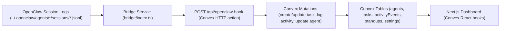

# Architecture

Claw is a Mission Control dashboard that combines:

- A Next.js frontend for operations visibility and control
- Convex as the realtime backend/data layer
- An optional bridge service that ingests local OpenClaw transcript events

## High-Level Flow

## Runtime Components

### 1. Frontend (`src/`)

- Framework: Next.js 15 + React 19 + TypeScript
- State/data: Convex React hooks (`useQuery`, `useMutation`)
- Main screen: `src/app/page.tsx`
- Key UI panels:
  - Agent panel
  - Mission queue (Kanban)
  - Live feed
  - Mission banner
  - Standup / calendar / search modals

### 2. Backend (`convex/`)

- `schema.ts` defines 5 tables:
  - `agents`
  - `tasks`
  - `activityEvents`
  - `standups`
  - `settings`
- `queries.ts` drives dashboard reads
- `mutations.ts` handles writes and rollups
- `http.ts` exposes `POST /api/openclaw-hook` for external ingest

### 3. Bridge (`bridge/`)

- Polls `~/.openclaw/agents/*/sessions/*.jsonl` every 2 seconds
- Parses JSONL transcript lines
- Maps transcript semantics into Convex events:
  - assistant text -> activity/comment
  - tool execution -> activity/status change + agent working status
  - completion language -> agent idle status
- Pushes payloads to Convex site URL (`CONVEX_SITE_URL`)

### 4. Infra (`infra/`)

- Cloudflare tunnel helper script (`setup-tunnel.sh`)
- Example cloudflared config (`cloudflared-config.yml`)
- Supports exposing OpenClaw gateway and dashboard hostnames

## UI Data Model Ownership

- Source of truth: Convex tables
- Frontend state:
  - UI-only toggles, modal state, and local drag-preview state
- Prototype/static data:
  - Calendar blocks are currently mocked in the component
  - Global search dataset is currently mocked in the component

## Notable Technical Decisions

- Build safety checks are relaxed in `next.config.ts`:
  - `typescript.ignoreBuildErrors = true`
  - `eslint.ignoreDuringBuilds = true`
- Turbopack loader injects `orchids-visual-edits/loader.js` for visual editing integration
- Mobile behavior uses a dedicated tab bar and safe-area spacing

## Tradeoffs

- Pros:
  - Fast local iteration with Convex realtime queries
  - Clear separation between ingest (bridge) and UI
  - Simple event contract for integration points
- Cons:
  - Bridge poll model can be inefficient at scale
  - Some UI surfaces are still mock-data driven
  - Build can succeed with lint/type issues due to relaxed checks
